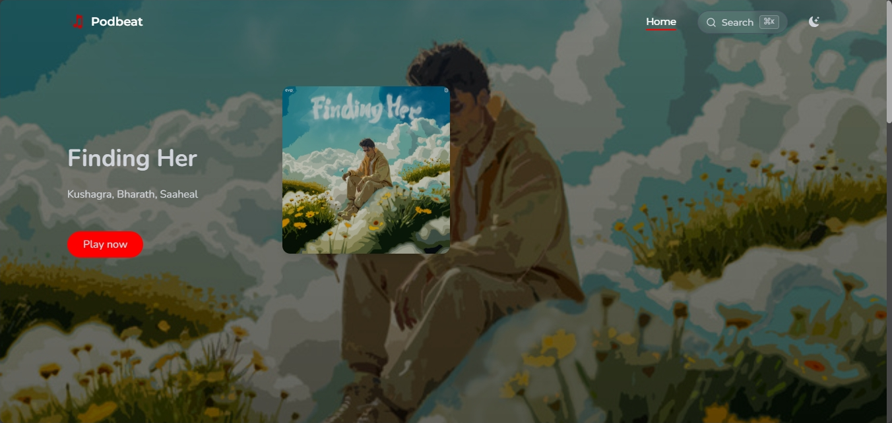

<div align="center" >
  <br/>
  <br/>
  
  <h1>Podbeat</h1>
  <br/>

  <p >
A modern music discovery app built with React and TypeScript. <br/> Browse tracks, albums, and artists with intelligent search and audio playback.
  </p>
</div>

<br/>
<br/>

## ✨ Features

### 🎵 Music Discovery

- **Smart Search**: Advanced search algorithm with genre-based filtering, year-based queries, and popularity scoring
- **Command Palette**: Press `Cmd+K` (Mac) or `Ctrl+K` (Windows) for instant search across tracks, albums, and artists
- **Latest Hits**: Curated collection of 2024-2025 chart-topping tracks from Spotify's top charts
- **Popular Tracks**: Classic hits and timeless favorites with verified metadata

### 🎧 Audio Experience

- **Mini Player**: Full-featured audio player with play/pause, seek, volume control, and shuffle/repeat modes
- **Preview Playback**: Real-time audio previews from Spotify's CDN when available
- **Visual Feedback**: Audio visualizer and progress indicators for enhanced user experience
- **Responsive Controls**: Touch-friendly controls optimized for mobile and desktop

### 🎨 User Interface

- **Modern Design**: Clean, responsive interface with dark/light theme support
- **Grid & List Views**: Toggle between detailed grid view and compact list view
- **Smooth Animations**: Framer Motion powered transitions and micro-interactions
- **Mobile Optimized**: Fully responsive design that works on all screen sizes

### 🔍 Advanced Search

- **Multi-term Search**: Intelligent search across track names, artists, albums, and genres
- **Genre Aliases**: Smart genre matching (e.g., "hip hop" matches "rap", "latin trap")
- **Year-based Queries**: Search by release year (e.g., "2024", "2023")
- **Popularity Filtering**: Results ranked by Spotify popularity scores

### 🚀 Performance

- **Lazy Loading**: Code splitting and lazy-loaded components for faster initial load
- **Caching**: Intelligent caching with RTK Query for optimal performance
- **Offline Support**: Graceful fallback to cached content when offline
- **Error Handling**: Comprehensive error boundaries and user-friendly error messages

## How it works

Podbeat runs in two modes depending on your setup:

### Demo mode (no API needed)

Without API credentials:

- Curated collection of 2024-2025 chart toppers with verified Spotify metadata
- Works immediately after `git clone` and `npm install`
- Real album artwork and track metadata from Spotify CDN
- Features artists like Billie Eilish, Harry Styles, Morgan Wallen, Taylor Swift, and more
- Enhanced search functionality with mock data

Benefits:

- Perfect for trying out the app quickly
- No API setup required
- Images load from Spotify CDN
- Shows off the full UI and search capabilities

<br/>

### With Spotify API (recommended)

If you have Spotify API credentials:

- Real-time access to Spotify's music catalog
- Search across millions of tracks, albums, and artists
- Latest trending songs and new releases
- All features available with live data

Requires:

- Spotify API credentials in `.env` file
- Backend server running for CORS handling

<br/>
Podbeat automatically detects which mode to use and provides seamless fallback.
<br/>

## :camera: Screenshots

### Hero Section

<kbd></kbd>

<br/>

### Homepage

<kbd></kbd>

<br/>
<br/>

## Getting started

You need Node.js 18+ and npm.

```bash
# Clone and install
git clone https://github.com/karadHub/podbeat.git
cd podbeat
npm install

# Start the app
npm run dev
```

Open `http://localhost:5173` - Podbeat works immediately with demo data and full functionality.

### 🎯 Quick Start Features

- **Search**: Use the search bar or press `Cmd+K`/`Ctrl+K` to open the command palette
- **Browse**: Explore the Latest Hits section with curated 2024-2025 tracks
- **Play**: Click any track to start the mini player with audio previews
- **Navigate**: Use the sidebar and header navigation for seamless browsing

<br>

### Want live Spotify data?

1. Create a [Spotify Developer Account](https://developer.spotify.com/) and create a new app
2. Get your Client ID and Client Secret from the app dashboard
3. Create a `.env` file in the root directory:
   ```bash
   touch .env
   ```
4. Add your credentials to `.env`:
   ```env
   VITE_SPOTIFY_CLIENT_ID=your_client_id_here
   VITE_SPOTIFY_CLIENT_SECRET=your_client_secret_here
   VITE_USE_BACKEND_PROXY=true
   ```
5. Start with the backend server:
   ```bash
   npm run dev:full
   ```

This will start both the backend server (port 3001) and frontend (port 5173) simultaneously.

<br/>

## 🏗️ Project Structure

```
src/
├── components/          # Reusable UI components
│   └── ui/             # Core UI components (CommandPalette, MiniPlayer, etc.)
├── pages/              # Route-based page components
│   ├── Home/           # Landing page with hero and sections
│   ├── Catalog/        # Browse tracks, albums, artists
│   └── Detail/         # Individual track/album/artist pages
├── services/           # API services and data management
│   ├── MusicAPI.ts     # Unified music data API
│   ├── SpotifyAPI.ts   # Spotify Web API integration
│   └── MCPAudioService.ts # Audio enhancement service
├── hooks/              # Custom React hooks
│   ├── useAudioPlayer.ts # Audio playback management
│   └── useCommandPalette.ts # Search and navigation
├── data/               # Mock data and constants
│   └── mockMusicData.ts # Curated 2024-2025 track data
├── common/             # Shared components and utilities
└── utils/              # Helper functions and configuration
```

### Key Components

- **CommandPalette**: Global search with keyboard shortcuts (`Cmd+K`/`Ctrl+K`)
- **MiniPlayer**: Full-featured audio player with controls
- **TrackCard/AlbumCard**: Responsive music item displays
- **Hero**: Dynamic landing section with featured tracks
- **Search**: Advanced search with filtering and sorting

<br/>

## Testing

```bash
# Run tests
npm test

# Run with coverage
npm run test:coverage
```

<br/>

## Build

```bash
npm run build
npm run preview
```

<br/>

## Tech Stack

### Frontend

- **React 18** with TypeScript for type-safe development
- **Vite** for fast development and optimized builds
- **Tailwind CSS** for utility-first styling
- **Framer Motion** for smooth animations and transitions
- **React Router v6** for client-side routing

### State Management & Data

- **Redux Toolkit** with RTK Query for efficient state management
- **Intelligent Caching** with content-aware cache durations
- **Offline Support** with graceful fallback to cached content

### Audio & Media

- **HTML5 Audio API** for preview playback
- **MCP Audio Service** for enhanced track metadata
- **Spotify CDN** for high-quality album artwork and previews

### Backend & API

- **Node.js** with Express.js for CORS proxy server
- **Spotify Web API** integration with retry logic and error handling
- **Client Credentials Flow** for secure API authentication

### Development & Testing

- **Vitest** for unit testing with React Testing Library
- **Playwright** for end-to-end testing
- **ESLint** with TypeScript support for code quality
- **MSW (Mock Service Worker)** for API mocking in tests

### UI Components

- **Radix UI** for accessible component primitives
- **React Aria Components** for advanced accessibility
- **Lucide React** for consistent iconography
- **Swiper.js** for touch-friendly carousels

<br>

## Troubleshooting

### Common Issues

**CORS Errors with Spotify API**

- **Problem:** API requests fail due to CORS restrictions
- **Solution:** Ensure the backend server is running (`npm run dev:full` or `npm run server:dev`)
- **Details:** Spotify Web API cannot be called directly from browsers due to CORS policy

**Missing Environment Variables**

- **Problem:** Podbeat shows "No music data available" or API errors
- **Solution:** Check that `.env` file exists with valid Spotify credentials
- **Note:** Podbeat works perfectly in demo mode without API credentials

**Port Conflicts**

- **Frontend (Port 5173):** Check if another Vite/dev server is running
- **Backend (Port 3001):** Check if another Express server is using the port
- **Solution:** Kill existing processes or modify port configuration

**Audio Playback Issues**

- **Problem:** Tracks don't play or show "No preview available"
- **Solution:** This is normal - not all tracks have preview URLs. Podbeat will show a simulation for tracks without previews
- **Details:** Preview availability depends on Spotify's licensing agreements

**Build/TypeScript Errors**

- **Problem:** TypeScript compilation errors during build
- **Solution:** Run `npm run build` to see specific error details
- **Common fix:** Ensure all dependencies are installed (`npm install`)

**Search Not Working**

- **Problem:** Command palette or search returns no results
- **Solution:** Try different search terms, check if you're in demo mode (which has limited but high-quality data)
- **Details:** Demo mode includes 20+ verified tracks from 2024-2025 charts

<br/>

### Getting Help

- Check the [GitHub Issues](https://github.com/natashaongiscoding/music-app/issues) for known problems
- Podbeat includes comprehensive error handling and user-friendly error messages
- Demo mode provides full functionality without requiring API setup

---

<div align="center">
  <p>Built with ❤️ for music lovers everywhere</p>
  <p>Discover your next favorite track with Podbeat</p>
</div>
